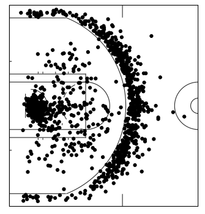
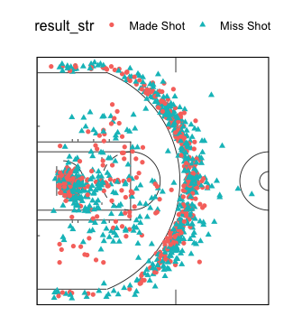
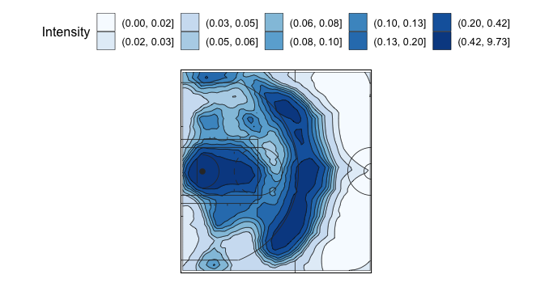

# ggbasketball: 'ggplot2' Based Visualization of Basketball Data

This package provides easy plotting for basketball data.

## Installation

Install from Github:

``` r
if(!require(devtools)) install.packages("devtools")
devtools::install_github("ys-xue/ggbasketball")
```

## Court

``` r
ggcourt(orientation = "wide")
```


## Shotchart

```r
# simple shot chart
data(shotdata)
harden <- shotdata[shotdata$Name == "James Harden", ]
ggshotchart(harden, x = "loc_x", y = "loc_y")
```


```r
#' # vary the color and shape by shot result
#' ggshotchart(harden, x = "loc_x", y = "loc_y", result = "result_str")
```


## Intensity Plot

```r
# with contours
ggshotintensity(green_intensity, x = "x", y = "y", value_col = "mean")
```



## References

* [Hu, G., Yang, H.C., Xue, Y. (2020) Bayesian Group Learning for Shot Selection
of Professional Basketball Players. Stat 10(1), e324](https://arxiv.org/pdf/2006.07513.pdf)

* [Hu, G., Yang, H.C., Xue, Y., Dey, D.K. (2021) Zero Inflated Poisson Model with Clustered Regression
Coefficients: an Application to Heterogeneity Learning
of Field Goal Attempts of Professional Basketball. Canadian Journal of Statistics, forthcoming](https://arxiv.org/pdf/2012.06715.pdf)

* [Jiao, J., Hu, G., Yan, J. (2021) A Bayesian Marked Spatial Point Processes Model for
Basketball Shot Chart. Journal of Quantitative Analysis in Sports 17(2)](https://arxiv.org/pdf/1908.05745.pdf)
