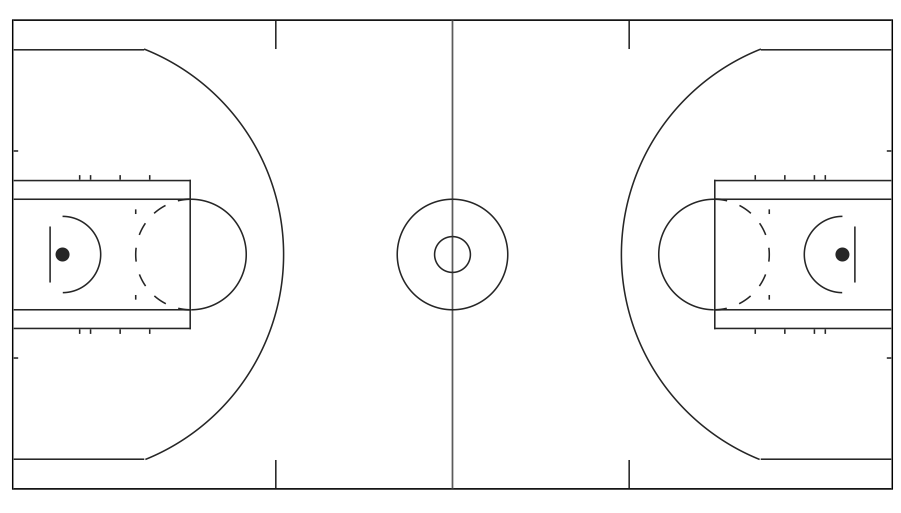

# ggbasketball: 'ggplot2' Based Visualization of Basketball Data

This package provides easy plotting for basketball data.

## Installation

Install from Github:

``` r
if(!require(devtools)) install.packages("devtools")
devtools::install_github("ys-xue/ggbasketball")
```

## Court

``` r
ggcourt(orientation = "wide")
```


